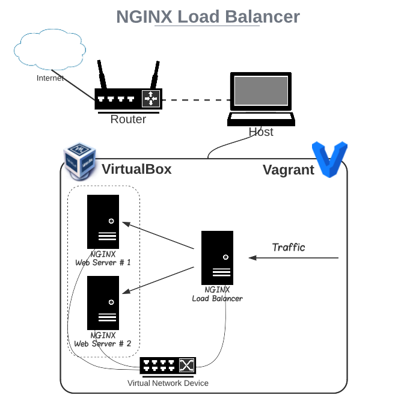

# Apache Reverse Proxy

This is an automated solution for Apache Reverse Proxy created through Vagrant. Follow the steps below:
 - clone the repository; 
 - open the directory in terminal;
 - execute the command `vagrant up`;
 - wait until the environment is ready.

#### Requirements:

 - Regular computer (Laptop or PC) with RAM 16+ GB, Disk: 80+ GB, and CPU: Intel/AMD x64 with virtualization support;
 - VirtualBox 6.1+:  https://www.virtualbox.org/wiki/Downloads;
 - Vagrant 2.1+:  https://developer.hashicorp.com/vagrant/downloads;

## Environment Details
The architecture of the environment looks like:

You can find detailed information about the boxes that I have used here - https://app.vagrantup.com/merev.

### Environment Information
The operating system installed on the hosts is Debian 11 / CentOS Stream 8. Each VM has 2 GB RAM, 2 CPUs, and 60 GB disk space. The hardware parameters can be adjusted before provisioning in the `config.vm.provider` block of the Vagrantfile. Every node has 2 network interfaces:
 - 1 NIC in NAT Mode - connected to the host machine;
 - 1 NIC in Host-Only Mode - connected to a separate virtual network for isolated communication between the VMs.
